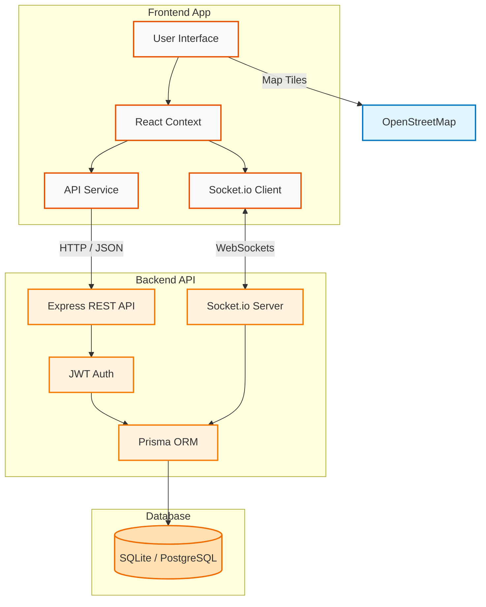
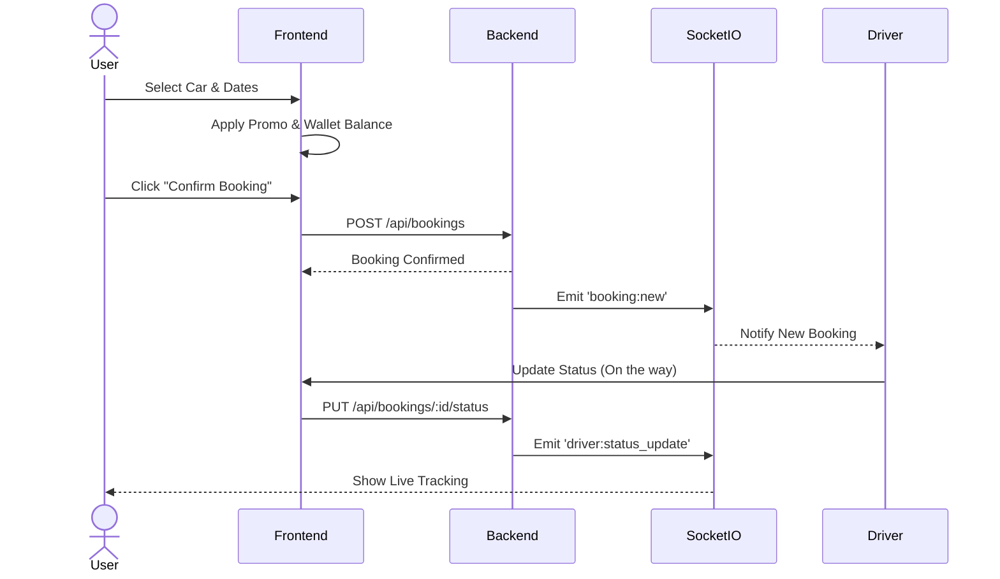
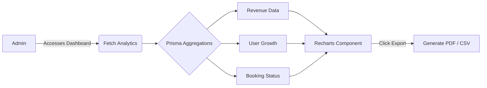

<div align="center">
  
  
  # 🚗 DesiRent (Let's Go) 
  **Premium Car Rental Platform for the Indian Market**
  
  <p>
    <a href="#-features"></a>
    <a href="#-tech-stack"></a>
    <a href="#-architecture"></a>
    <a href="#-getting-started"></a>
  </p>

  <p>
    
    
    
    
    
    
  </p>
  
  <i>Seamlessly bridging the gap between luxury and affordability for your next road trip.</i>
</div>

---

## 📖 Overview

**DesiRent** is a full-stack, real-time car rental application built specifically to address the modern needs of the Indian car rental industry. It delivers an incredibly polished, native-like web experience with glassmorphism UI, real-time tracking, an integrated wallet, and comprehensive role-based dashboards.

---

## ✨ Features

### 🤵 For Customers
* **Stunning UI/UX**: Premium dark-mode accents, floating form labels, and hover-scaling glassmorphism cards.
* **Integrated Wallet**: Add funds to a digital wallet and pay for rides seamlessly without external gateways.
* **Smart Promo Codes**: Dynamic discount system to attract more bookings.
* **Real-time Tracking**: Watch your driver approach your location live on an interactive map.

### 🛡️ For Admins
* **Analytics Dashboard**: Live revenue data and user growth visualised using interactive `Recharts`.
* **Exportable Reports**: Generate beautiful `jsPDF` invoices or standard `CSV` spreadsheets with a single click.
* **Fleet Management**: Easily track which cars are booked, available, or out for maintenance.

### 🚕 For Drivers
* **Driver Dashboard**: Simulated driver flow to accept bookings, update trip statuses ("Arrived", "On Trip", "Completed"), and instantly notify the customer.

---

## 🏗️ Architecture

The application follows a modern client-server architecture with real-time WebSocket capabilities. *(Note: Diagram labels are cleanly formatted for GitHub parsing).*



---

## 🔄 Core Workflows

### 1. The Booking Engine
How a user successfully books a car and interacts with the driver in real-time.



### 2. Admin Analytics
How admins generate reports and view revenue streams.



---

## 🚀 Getting Started

### Prerequisites
- **Node.js** (v18+ recommended)
- **npm** or **yarn**

### Installation

1. **Clone the repository:**
   ```bash
   git clone https://github.com/Rohitsingh910/Car-rental-website.git
   cd Car-rental-website
   ```

2. **Install Frontend Dependencies:**
   ```bash
   npm install
   ```

3. **Install Backend Dependencies:**
   ```bash
   cd server
   npm install
   ```

4. **Environment Variables:**
   Create a `.env` file in the `server` directory:
   ```env
   DATABASE_URL="file:./dev.db" # Or your PostgreSQL URL when ready
   JWT_SECRET="your_super_secret_key"
   PORT=5000
   ```

### Running the Platform

**Start the Backend API:**
```bash
# In the /server directory
npm run dev
```

**Start the Frontend App:**
```bash
# In the root directory
npm run dev
```

Visit `http://localhost:5173` in your browser.

---

## 🧪 Testing

The project uses **Vitest** for incredibly fast unit and component testing.

```bash
# Run tests in CLI
npm run test

# Run tests with interactive UI
npm run test -- --ui
```

---

<div align="center">
  <h3>Built with ❤️ for the Indian roads.</h3>
  <p>© 2024 DesiRent</p>
</div>
