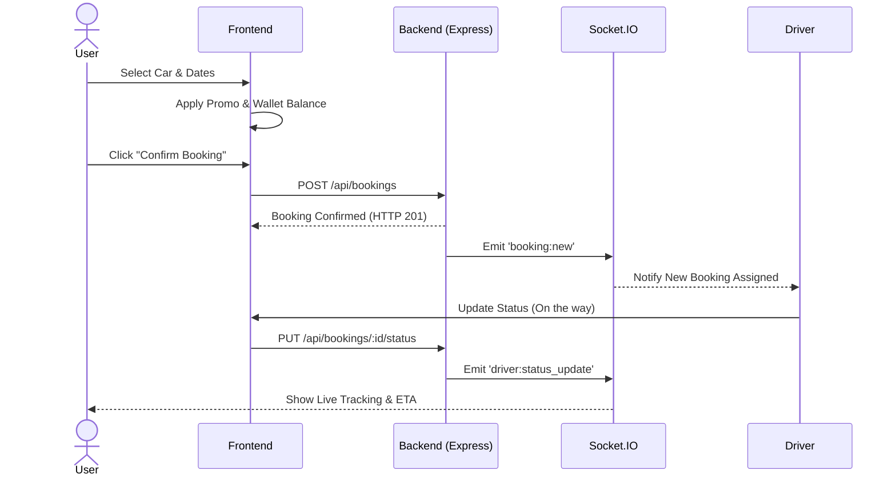
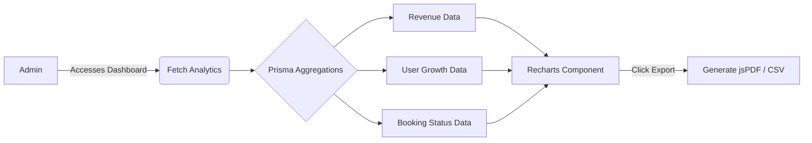

<div align="center">
  
  
  # 🚗 DesiRent (Let's Go) 
  **Premium Car Rental Platform for India**
  
  <p>
    
    
    
    
    
    
  </p>
</div>

---

## 📖 Overview

**DesiRent** is a full-stack, real-time car rental application tailored for the Indian market (specifically Noida & Delhi NCR). It bridges the gap between luxury and affordability, providing an incredibly polished UI/UX, real-time booking tracking, an integrated wallet system, and comprehensive admin/driver dashboards.

## ✨ Key Features

- **🎨 Premium UI/UX:** Stunning glassmorphism, floating labels, advanced hover animations, and a sleek Dark Mode footer.
- **⚡ Real-time Updates (Socket.io):** Instant notifications when cars are booked, and real-time live location tracking of drivers on a map.
- **💼 Integrated Wallet System:** Users can top-up their digital wallet, view transaction history, and pay for rides seamlessly.
- **🎟️ Promo Code Engine:** Dynamic discount system integrated directly into the booking modal.
- **👮 Three-Tier Architecture:** Dedicated dashboards for **Users**, **Admins** (with Recharts analytics, PDF/CSV export), and **Drivers** (with trip statuses).
- **🛠️ Automated Testing:** Fully configured with `Vitest` and `React Testing Library`.

---

## 🏗️ System Architecture

The application follows a modern client-server architecture with real-time websocket capabilities.

```mermaid
graph TD
    %% Define Styles
    classDef client fill:#f9f9f9,stroke:#e65100,stroke-width:2px,color:#333
    classDef server fill:#fff3e0,stroke:#f57c00,stroke-width:2px,color:#333
    classDef db fill:#ffe0b2,stroke:#ef6c00,stroke-width:2px,color:#333
    classDef external fill:#e1f5fe,stroke:#0277bd,stroke-width:2px,color:#333

    %% Client Side
    subgraph Client [Frontend (React + Vite)]
        UI[User Interface]:::client
        State[React Context / Auth]:::client
        API_Client[Axios / Fetch]:::client
        Socket_Client[Socket.io Client]:::client
        
        UI --> State
        State --> API_Client
        State --> Socket_Client
    end

    %% Server Side
    subgraph Server [Backend (Node.js + Express)]
        API_Server[Express REST API]:::server
        Socket_Server[Socket.io Server]:::server
        Auth_Middleware[JWT Auth Middleware]:::server
        Prisma[Prisma ORM]:::server
        
        API_Client -->|HTTP / JSON| API_Server
        Socket_Client <-->|WebSockets| Socket_Server
        
        API_Server --> Auth_Middleware
        Auth_Middleware --> Prisma
        Socket_Server --> Prisma
    end

    %% Database
    subgraph DatabaseLayer [Database]
        DB[(SQLite / PostgreSQL)]:::db
        Prisma --> DB
    end

    %% External
    Maps[OpenStreetMap / Leaflet]:::external
    UI -->|Map Tiles| Maps
```

---

## 🔄 Core Workflows

### 1. Booking Workflow
How a user successfully books a car and interacts with the driver.



### 2. Admin Analytics Flow


---

## 📂 Folder Structure

```text
📦 src
 ┣ 📂 assets           # Static assets (images, icons)
 ┣ 📂 components       # Reusable React components
 ┃ ┣ 📜 AboutSection.tsx    # Premium redesigned About page
 ┃ ┣ 📜 AdminDashboard.tsx  # Admin panel with charts
 ┃ ┣ 📜 BookingModal.tsx    # Handles Wallet & Promos
 ┃ ┣ 📜 CarCard.tsx         # Glassmorphism car display
 ┃ ┣ 📜 Navbar.tsx          # Sticky, glass-blur header
 ┃ ┗ 📜 ...
 ┣ 📂 context          # React Context (AuthContext)
 ┣ 📂 data             # Static mock data & fallback types
 ┣ 📂 services         # API and Socket integrations
 ┃ ┣ 📜 api.ts
 ┃ ┗ 📜 socket.ts
 ┣ 📜 App.tsx          # Main application routing and state
 ┣ 📜 index.css        # Tailwind global styles
 ┣ 📜 main.tsx         # Entry point
 ┗ 📜 setupTests.ts    # Vitest configuration
```

---

## 🚀 Getting Started

### Prerequisites
- Node.js (v18+ recommended)
- npm or yarn

### Installation

1. **Clone the repository:**
   ```bash
   git clone https://github.com/yourusername/desirent.git
   cd desirent
   ```

2. **Install Frontend Dependencies:**
   ```bash
   npm install
   ```

3. **Install Backend Dependencies** *(Assuming backend is in a `server` folder)*:
   ```bash
   cd server
   npm install
   ```

4. **Environment Variables:**
   Create a `.env` file in your server directory:
   ```env
   DATABASE_URL="file:./dev.db" # Or your PostgreSQL URL
   JWT_SECRET="your_super_secret_key"
   PORT=5000
   ```

### Running the App

Run the Backend server:
```bash
# In the server directory
npm run dev
```

Run the Frontend Vite server:
```bash
# In the root directory
npm run dev
```

Visit `http://localhost:5173` in your browser.

---

## 🧪 Testing

The project uses **Vitest** for incredibly fast unit and component testing.

To run the tests:
```bash
npm run test
```
To run tests with UI coverage:
```bash
npm run test -- --ui
```

---

## 🎨 UI Showcase
*(You can add screenshots of your beautiful UI here!)*
- **Navbar & Hero:** Transparent to glass blur scroll effect.
- **Car Cards:** Hover-scaling, dynamic badges, glassmorphism.
- **Contact Form:** Floating labels, 3D hover states.
- **Admin Dashboard:** Recharts, Export functionality.

---

<div align="center">
  <p>Built with ❤️ for the Indian roads.</p>
  <p>© 2024 DesiRent</p>
</div>
